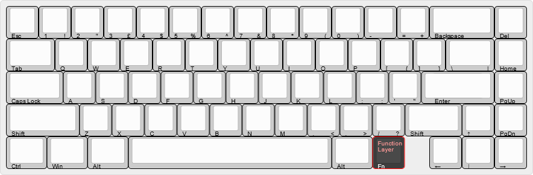
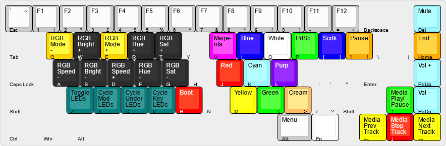

# Massdrop ALT v2 - Beiufin

## Layers

### Base Layer

### Function Layer

## Dual RGB

When the [Dual RGB Matrix](/docs/feature_dual_rgb_matrix.md) feature is enabled, there will be two RGB systems. I will refer to these as "primary" and "secondary"
Within the function layer, all the keys that affect the primary RGB can also affect the secondary RGB by holding "Alt" when pressing them.  
This includes all the colors, the keys labeled RGB..., and the "Toggle LEDs" key.

The "Cycle ... LEDs" keys will cycle sets of LEDs between the primary RGB, then secondary RGB, then neither.  
For example, if the underglow LEDs are current in the primary RGB system, pressing "Cycle Under(glow) LEDs" will switch them to the secondary RGB system. Pressing it again will switch them to off (meaning they arent in the primary or secondary RGB systems). Pressing it a third time will switch them back to the primary RGB system.

## RGB effect

Descriptions (and order) of all RGB effects can be found [here](/docs/feature_rgb_matrix.md?rgb-matrix-effects-idrgb-matrix-effects).

The following RGB effects/animations are enabled (in order):

-   solid_color
-   alphas_mods
-   gradient_up_down
-   gradient_left_right
-   breathing
-   band_sat
-   band_val
-   band_pinwheel_sat
-   band_pinwheel_val
-   band_spiral_sat
-   band_spiral_val
-   cycle_all
-   cycle_left_right
-   cycle_up_down
-   rainbow_moving_chevron
-   cycle_out_in
-   cycle_out_in_dual
-   cycle_pinwheel
-   cycle_spiral
-   dual_beacon
-   rainbow_beacon
-   rainbow_pinwheels
-   raindrops
-   jellybean_raindrops
-   hue_breathing
-   hue_pendulum
-   hue_wave
-   pixel_fractal
-   pixel_flow
-   pixel_rain
-   apm
-   typing_heatmap
-   typing_heatmap_val
-   **typing_heatmap_hue** (default)
-   digital_rain
-   solid_reactive_simple
-   solid_reactive
-   solid_reactive_wide
-   solid_reactive_multiwide
-   solid_reactive_cross
-   solid_reactive_multicross
-   solid_reactive_nexus
-   solid_reactive_multinexus
-   splash
-   multisplash
-   solid_splash
-   solid_multisplash
-   starlight
-   starlight_dual_sat
-   starlight_dual_hue
-   riverflow
